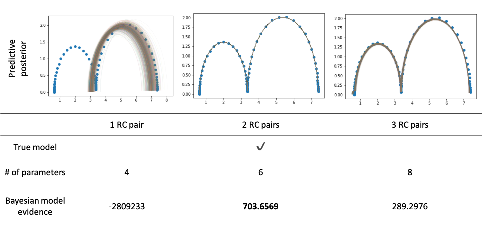

# BayesianModelSelection
This repository contains the python code that was presented for the IFAC.

Adachi, M., Kuhn, Y., Horstmann, B., Osborne, M. A., Howey, D. A. 
Bayesian Model Selection of Lithium-Ion Battery Models via Bayesian Quadrature, IFAC 2023 [link](https://doi.org/10.1016/j.ifacol.2023.10.1073)

This work is based on the BASQ [repository](https://github.com/ma921/BASQ)




## News
Recently we have published a new method that achieves faster convergence.
https://github.com/ma921/SOBER <br>
Try it out the tutorial 05 for comparing.

## Features
- fast Bayesian inference via Bayesian quadrature
- Simultaneous inference of Bayesian model evidence and posterior
- GPU acceleration
- Canonical equivalent circuit model (ECM)
- Statistical analysis computation of the ECM

## Requirements
- PyTorch
- GPyTorch
- BoTorch
- functorch

## Getting started
Open "ECM_model_selection.ipynb".
This will give you a step-by-step introduction.

## Cite as

Please cite this work as
```
@article{adachi2023bayesian,
  title={Bayesian model selection of lithium-ion battery models via {B}ayesian quadrature},
  author={Adachi, Masaki and Kuhn, Yannick and Horstmann, Birger and Latz, Arnulf and Osborne, Michael A and Howey, David A},
  journal={IFAC-PapersOnLine},
  volume={56},
  number={2},
  pages={10521--10526},
  year={2023},
  doi={https://doi.org/10.1016/j.ifacol.2023.10.1073},
  publisher={Elsevier}
}
```
Also please consider to cite this work as well.
```
@article{adachi2022fast,
  title={Fast {B}ayesian inference with batch {B}ayesian quadrature via kernel recombination},
  author={Adachi, Masaki and Hayakawa, Satoshi and J{\o}rgensen, Martin and Oberhauser, Harald and Osborne, Michael A},
  journal={Advances in Neural Information Processing Systems},
  volume={35},
  doi={https://doi.org/10.48550/arXiv.2206.04734},
  year={2022}
}
```
